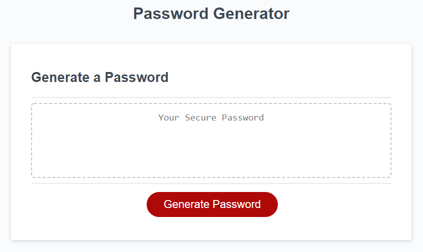

# Password_Generator_Challenge_03
Monica's Password Generator

The application allows users to generate random passwords based on criteria that they select. Users may chose to include lowercase, uppercase, numeric, and/or special characters in their passwords.  The application features a responsive user interface that adapts to multiple screen sizes.

Application deployed at live URL : <a href= "https://monicadolce.github.io/Password_Generator_Challenge_03/">Visit Live Password Generator</a>

Application GitHub URL : <a href="https://github.com/monicadolce/Password_Generator_Challenge_03">Visit Monica's GitHub Repository</a> 

